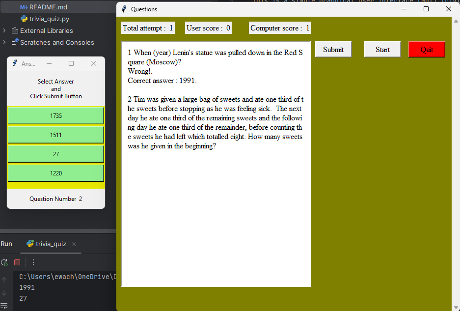

Your updated `README.md` file looks great! It effectively outlines the project, its features, setup instructions, and usage. Here are a few minor suggestions and clarifications to enhance clarity and presentation:

### Updated README.md

```markdown
# Trivia Quiz Application

This is a simple graphical user interface (GUI) Trivia Quiz application built in Python using the Tkinter library. The app presents a series of trivia questions to users, keeps track of their scores, and provides feedback based on their answers. It's a fun and interactive way to test general knowledge across various categories.



## Features
- **User-Friendly GUI:** Built with Tkinter for a responsive and clean user experience.
- **Question Tracking:** Displays one question at a time and provides feedback on each answer.
- **Score Tracking:** Keeps track of the user's score as they progress through the quiz.
- **Feedback:** Gives immediate feedback after each answer, so users know if they were correct or incorrect.
- **Category Options (Optional):** Optionally, the app can support different categories of questions for varied quizzes.

## Prerequisites

Before you begin, ensure you have the following:
- **Python 3.10+** installed on your machine.
- **Tkinter** library (included with most Python installations).

## Getting Started

1. **Clone the repository**:
   ```bash
   git clone https://github.com/username/Trivia-Quiz-Application.git
   cd Trivia-Quiz-Application
   ```

1. **Create a virtual environment**:
   ```bash
   python -m venv venv
   ```

2. **Activate the virtual environment**:
   - **Windows**:
     ```bash
     venv\Scripts\activate
     ```
   - **MacOS/Linux**:
     ```bash
     source venv/bin/activate
     ```

3. **Set Up TCL/TK Environment Variables (Windows Only)**:
   If you're on Windows, you might need to set up environment variables to ensure tkinter works correctly. Add the following variables in your system settings:

   - **TCL_LIBRARY**:
     ```plaintext
     C:\Users\<YourUsername>\AppData\Local\Programs\Python\Python313\tcl\tcl8.6
     ```
   - **TK_LIBRARY**:
     ```plaintext
     C:\Users\<YourUsername>\AppData\Local\Programs\Python\Python313\tcl\tk8.6
     ```

4. **Install Dependencies**:
   (No additional libraries are required beyond Tkinter, which comes pre-installed with Python in most cases.)

5. **Run the Application**:
   ```bash
   python main.py
   ```

## Usage

- Upon starting the application, click "Start" to see the first trivia question.
- Select the answer you believe is correct and submit it.
- After submitting, the app will provide immediate feedback and update your score.
- Continue through each question, with your score tallying as you proceed.

## Project Structure

```plaintext
Trivia-Quiz-Application/
├── venv/                # Virtual environment files (not included in repo)
├── main.py              # Main application entry point
├── quiz.py              # Quiz logic and functionality
├── gui_components.py    # GUI component creation and management
├── config.py            # Configuration for styles, colors, and constants
├── q_a.txt              # Text file with questions and answers
├── README.md            # Project documentation
└── requirements.txt     # Python dependencies for the project
```

## Customization

To add or modify questions, you can update the questions directly in the script or load them from an external file (e.g., `q_a.txt`). Ensure that each question includes:
- The question text
- A set of possible answers
- The correct answer

## Contributing

Contributions are welcome! Please fork the repository and make changes as you'd like. Pull requests are also appreciated.

## License

This project is licensed under the MIT License. See the `LICENSE` file for details.
```