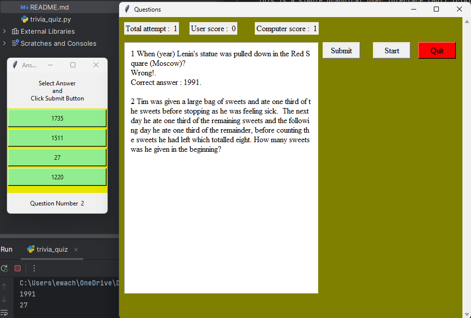

# Trivia Quiz Application

A simple graphical user interface (GUI) Trivia Quiz application built in Python using Tkinter. The app presents trivia questions, tracks scores, and provides instant feedback, making it an interactive way to test general knowledge.



## Features
- **User-Friendly Interface** – Built with Tkinter for a clean and responsive experience.
- **Question Tracking** – Displays one question at a time and provides feedback on each answer.
- **Score Tracking** – Keeps track of the user's score throughout the quiz.
- **Instant Feedback** – Notifies users immediately whether their answer was correct or incorrect.
- **Category Options (Optional)** – Supports different quiz categories for variety.

## Prerequisites
Ensure you have the following before starting:
- **Python 3.10+** installed.
- **Tkinter** (included with most Python installations).

## Getting Started
### 1. Clone the Repository
```bash
git clone https://github.com/username/Trivia-Quiz-Application.git
cd Trivia-Quiz-Application
```

### 2. Create and Activate a Virtual Environment
```bash
python -m venv venv
```
#### Windows:
```bash
venv\Scripts\activate
```
#### macOS/Linux:
```bash
source venv/bin/activate
```

### 3. Set Up TCL/TK Environment Variables (Windows Only)
If you encounter issues with Tkinter, configure these environment variables:

- **TCL_LIBRARY**:
  ```plaintext
  C:\Users\<YourUsername>\AppData\Local\Programs\Python\Python313\tcl\tcl8.6
  ```
- **TK_LIBRARY**:
  ```plaintext
  C:\Users\<YourUsername>\AppData\Local\Programs\Python\Python313\tcl\tk8.6
  ```

### 4. Install Dependencies
(No additional installations required beyond Tkinter.)

### 5. Run the Application
```bash
python main.py
```

## Usage
1. Click "Start" to begin the quiz.
2. Select an answer and submit it.
3. Receive instant feedback and score updates.
4. Continue through the quiz and track progress.

## Project Structure
```plaintext
Trivia-Quiz-Application/
├── venv/                # Virtual environment files (not included in repo)
├── main.py              # Main application entry point
├── quiz.py              # Quiz logic and functionality
├── gui_components.py    # GUI component creation and management
├── config.py            # Configuration for styles, colors, and constants
├── q_a.txt              # Text file with questions and answers
├── README.md            # Project documentation
└── requirements.txt     # Python dependencies for the project
```

## Customization
To add or modify questions, update `q_a.txt` or the script directly, ensuring each entry includes:
- The question text
- Possible answers
- The correct answer

## Contributing
Contributions are welcome! Fork the repository and submit a pull request with your improvements.

## License
This project is licensed under the MIT License. See the `LICENSE` file for details.

# Trivia Quiz Application

A simple graphical user interface (GUI) Trivia Quiz application built in Python using Tkinter. The app presents trivia questions, tracks scores, and provides instant feedback, making it an interactive way to test general knowledge.


## Features
- **User-Friendly Interface** – Built with Tkinter for a clean and responsive experience.
- **Question Tracking** – Displays one question at a time and provides feedback on each answer.
- **Score Tracking** – Keeps track of the user's score throughout the quiz.
- **Instant Feedback** – Notifies users immediately whether their answer was correct or incorrect.
- **Category Options (Optional)** – Supports different quiz categories for variety.

## Prerequisites
Ensure you have the following before starting:
- **Python 3.10+** installed.
- **Tkinter** (included with most Python installations).

## Getting Started
### 1. Clone the Repository
```bash
git clone https://github.com/username/Trivia-Quiz-Application.git
cd Trivia-Quiz-Application
```

### 2. Create and Activate a Virtual Environment
```bash
python -m venv venv
```
#### Windows:
```bash
venv\Scripts\activate
```
#### macOS/Linux:
```bash
source venv/bin/activate
```

### 3. Set Up TCL/TK Environment Variables (Windows Only)
If you encounter issues with Tkinter, configure these environment variables:

- **TCL_LIBRARY**:
  ```plaintext
  C:\Users\<YourUsername>\AppData\Local\Programs\Python\Python313\tcl\tcl8.6
  ```
- **TK_LIBRARY**:
  ```plaintext
  C:\Users\<YourUsername>\AppData\Local\Programs\Python\Python313\tcl\tk8.6
  ```

### 4. Install Dependencies
(No additional installations required beyond Tkinter.)

### 5. Run the Application
```bash
python main.py
```

## Usage
1. Click "Start" to begin the quiz.
2. Select an answer and submit it.
3. Receive instant feedback and score updates.
4. Continue through the quiz and track progress.

## Project Structure
```plaintext
Trivia-Quiz-Application/
├── venv/                # Virtual environment files (not included in repo)
├── main.py              # Main application entry point
├── quiz.py              # Quiz logic and functionality
├── gui_components.py    # GUI component creation and management
├── config.py            # Configuration for styles, colors, and constants
├── q_a.txt              # Text file with questions and answers
├── README.md            # Project documentation
└── requirements.txt     # Python dependencies for the project
```

## Customization
To add or modify questions, update `q_a.txt` or the script directly, ensuring each entry includes:
- The question text
- Possible answers
- The correct answer

## Contributing
Contributions are welcome! Fork the repository and submit a pull request with your improvements.

## License
This project is licensed under the MIT License. See the `LICENSE` file for details.

# Trivia Quiz Application

A simple graphical user interface (GUI) Trivia Quiz application built in Python using Tkinter. The app presents trivia questions, tracks scores, and provides instant feedback, making it an interactive way to test general knowledge.


## Features
- **User-Friendly Interface** – Built with Tkinter for a clean and responsive experience.
- **Question Tracking** – Displays one question at a time and provides feedback on each answer.
- **Score Tracking** – Keeps track of the user's score throughout the quiz.
- **Instant Feedback** – Notifies users immediately whether their answer was correct or incorrect.
- **Category Options (Optional)** – Supports different quiz categories for variety.

## Prerequisites
Ensure you have the following before starting:
- **Python 3.10+** installed.
- **Tkinter** (included with most Python installations).

## Getting Started
### 1. Clone the Repository
```bash
git clone https://github.com/username/Trivia-Quiz-Application.git
cd Trivia-Quiz-Application
```

### 2. Create and Activate a Virtual Environment
```bash
python -m venv venv
```
#### Windows:
```bash
venv\Scripts\activate
```
#### macOS/Linux:
```bash
source venv/bin/activate
```

### 3. Set Up TCL/TK Environment Variables (Windows Only)
If you encounter issues with Tkinter, configure these environment variables:

- **TCL_LIBRARY**:
  ```plaintext
  C:\Users\<YourUsername>\AppData\Local\Programs\Python\Python313\tcl\tcl8.6
  ```
- **TK_LIBRARY**:
  ```plaintext
  C:\Users\<YourUsername>\AppData\Local\Programs\Python\Python313\tcl\tk8.6
  ```

### 4. Install Dependencies
(No additional installations required beyond Tkinter.)

### 5. Run the Application
```bash
python main.py
```

## Usage
1. Click "Start" to begin the quiz.
2. Select an answer and submit it.
3. Receive instant feedback and score updates.
4. Continue through the quiz and track progress.

## Project Structure
```plaintext
Trivia-Quiz-Application/
├── venv/                # Virtual environment files (not included in repo)
├── main.py              # Main application entry point
├── quiz.py              # Quiz logic and functionality
├── gui_components.py    # GUI component creation and management
├── config.py            # Configuration for styles, colors, and constants
├── q_a.txt              # Text file with questions and answers
├── README.md            # Project documentation
└── requirements.txt     # Python dependencies for the project
```

## Customization
To add or modify questions, update `q_a.txt` or the script directly, ensuring each entry includes:
- The question text
- Possible answers
- The correct answer

## Contributing
Contributions are welcome! Fork the repository and submit a pull request with your improvements.

## License
This project is licensed under the MIT License. See the `LICENSE` file for details.

